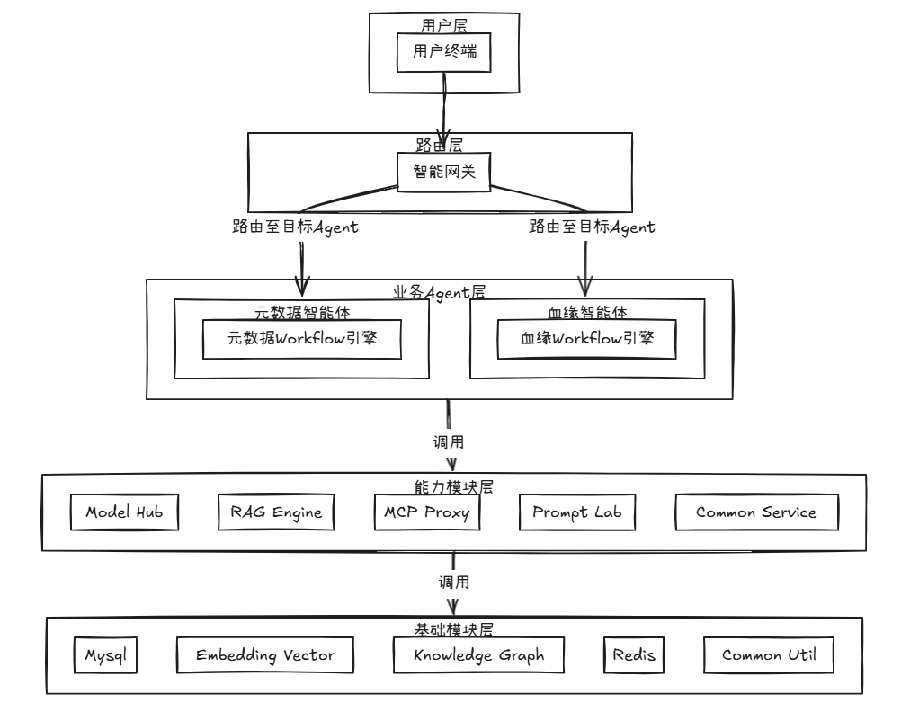
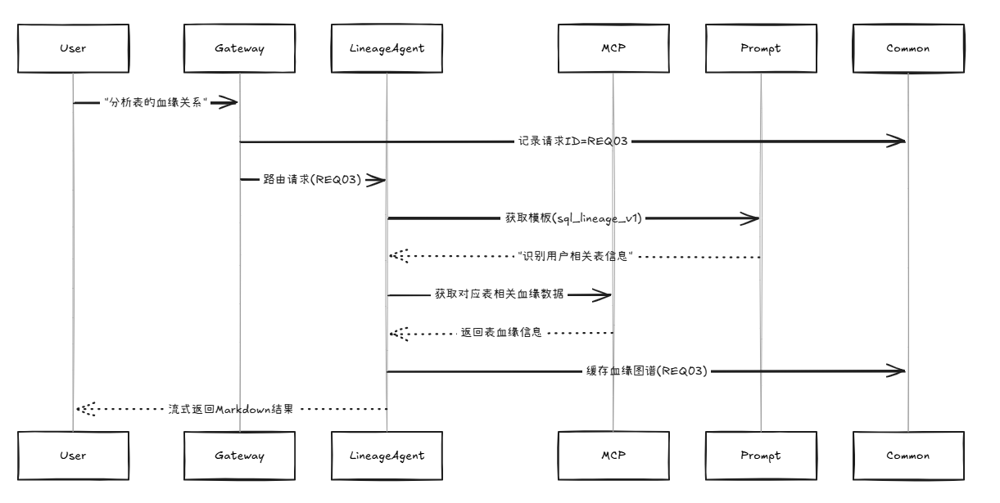

# 元织智能体
元数据编织，让数据智能化使用

采用A2A架构

先实现基于业务场景的智能体，通过不同的agent组合，最终实现数据的AI SQL coding。

初步设想：
- 让AI能够获取到元数据和元数据血缘信息
- 进行odps sql的RAG以学习语法或开发规范
- 制作sql coding agent
- 制作检核agent，运行sql同时判断结果进行校验
- 制作统一网关，路由不同的查询意图

基于现有数据资产系统，目前先实现元数据查询、数据血缘查询智能体，采用ReAct实现元数据相关信息的问题分析。
## 整体架构


## 数据血缘智能体示例



## 运行效果
注：涉及隐私，脱敏消息进行展示
### 1.元数据agent查询
帮我查一下table_company的urn字段的相关信息
```
{
"success": true,
"message": "元数据查询成功",
"result": "找到了以下与 `table_company` 中 `urn` 字段相关的详细信息：

		| 中文名 | 英文名 | instId |
		| --- | --- | --- |
		| 企业机构名称(客户名称) | urn | 70bd71f5611d40989201ce2a6ceb1855 |

		如需更多信息，请随时告诉我！"
}
```
### 2.血缘agent查询
帮我查一下instId为c194bffa377fa699f9369ec028466174的urn字段由哪些数据加工来的
```
{
"success": true,
"message": "血缘查询成功",
"result": "对于 `instId` 为 `c194bffa377fa699f9369ec028466174` 的元数据，其下游血缘关系如下：

		```
		下游血缘关系:
		1. 元数据instId: f936d42f957790eaa2962c2148e0fe32
		   - 元数据路径: /database/table
		   - 元数据类型: OdpsTable
		   - 元数据系统名称: SY0p7QUt1oPmM
		   - 关系创建时间: 2025-07-21 18:17:31

		2. 元数据instId: ea4efae23f314735e74c12e3fb955b10
		   - 元数据路径: /database/table
		   - 元数据类型: OdpsTable
		   - 元数据系统名称: SY0p7QUt1oPmM
		   - 关系创建时间: 2025-07-21 19:54:10

		3. 元数据instId: 3c402af153ba56f5ccc81cedcf7688d2
		   - 元数据路径: /database/table
		   - 元数据类型: OdpsTable
		   - 元数据系统名称: SY0p7QUt1oPmM
		   - 关系创建时间: 2025-07-21 20:02:05

		4. 元数据instId: 0e46abe71a666947107e7917a6d5d32c
		   - 元数据路径: /database/table
		   - 元数据类型: OdpsTable
		   - 元数据系统名称: SY0p7QUt1oPmM
		   - 关系创建时间: 2025-07-21 18:17:31

		5. 元数据instId: 21bb14396750f86bf15bc94ad50cee3f
		   - 元数据路径: /database/table
		   - 元数据类型: OdpsTable
		   - 元数据系统名称: SY0p7QUt1oPmM
		   - 关系创建时间: 2025-07-21 19:54:10

		6. 元数据instId: ac4be4bd33eb2481facd4a431708ceec
		   - 元数据路径: /database/table
		   - 元数据类型: OdpsTable
		   - 元数据系统名称: SY0p7QUt1oPmM
		   - 关系创建时间: 2025-07-21 18:17:31

		7. 元数据instId: 2a207abbe214177777e86d2ee6a8805e
		   - 元数据路径: /database/table
		   - 元数据类型: OdpsTable
		   - 元数据系统名称: SY0p7QUt1oPmM
		   - 关系创建时间: 2025-07-21 18:17:31

		8. 元数据instId: a322f53349883a9f2ad21dd005a7b97e
		   - 元数据路径: /database/table
		   - 元数据类型: OdpsTable
		   - 元数据系统名称: SY0p7QUt1oPmM
		   - 关系创建时间: 2025-07-21 18:17:31

		9. 元数据instId: 44335108a2e2c4a7f6ba30317f3c770e
		   - 元数据路径: /database/table
		   - 元数据类型: OdpsTable
		   - 元数据系统名称: SY0p7QUt1oPmM
		   - 关系创建时间: 2025-07-21 18:13:01

		10. 元数据instId: e1f62f2abcb08cf73953ab3f87dd34aa
			- 元数据路径: /database/table
			- 元数据类型: OdpsTable
			- 元数据系统名称: SY0p7QUt1oPmM
			- 关系创建时间: 2025-07-21 18:07:00

		11. 元数据instId: efbd3c81951552e47d8713d76fbea76e
			- 元数据路径: /app_ado/table
			- 元数据类型: OdpsTable
			- 元数据系统名称: SY0p7QUiQ6W5i
			- 关系创建时间: 2025-07-21 19:33:07

		12. 元数据instId: 31671c88e08a6286e3e4afb11fce12ba
			- 元数据路径: /database/table
			- 元数据类型: OdpsTable
			- 元数据系统名称: SY0p7QUt1oPmM
			- 关系创建时间: 2025-07-21 19:54:10

		13. 元数据instId: fcecd4c569b781ef7076182415916b56
			- 元数据路径: /database/table
			- 元数据类型: OdpsTable
			- 元数据系统名称: SY0p7QUt1oPmM
			- 关系创建时间: 2025-07-21 20:02:05

		14. 元数据instId: 77f1bde0f514e79dfe00dd2037e69b58
			- 元数据路径: /database/table
			- 元数据类型: OdpsTable
			- 元数据系统名称: SY0p7QUt1oPmM
			- 关系创建时间: 2025-07-21 19:32:56

		15. 元数据instId: c9dcb7508af5d5f87a0352a5558fe746
			- 元数据路径: /database/table
			- 元数据类型: OdpsTable
			- 元数据系统名称: SY0p7QUt1oPmM
			- 关系创建时间: 2025-07-21 18:17:31

		16. 元数据instId: 876426167ee23d4377fe165bb8e67f61
			- 元数据路径: /database/table
			- 元数据类型: OdpsTable
			- 元数据系统名称: SY0p7QUt1oPmM
			- 关系创建时间: 2025-07-21 18:17:31
		```

		上游血缘关系查询结果为 `[]`，表示该元数据没有直接的上游依赖。

		如需进一步分析，请告诉我！",
    "instId": null,
    "depth": 1
}
```
### 3.元数据和血缘组合查询
帮我查一下指标集市的这张table表，都被下游哪些系统使用了，分别是哪些表，要求3层以内的结果
```
{
"originalQuery": "帮我查一下指标集市的这张table表，都被下游哪些系统使用了，分别是哪些表，要求3层以内的结果",
"steps": [
        {
        "iteration": 1,
        "llmResponse": "{
                \"action_type\": \"call_agent\",
                \"agent_name\": \"metadata_agent\",
                \"request_body\": {
                \"query\": \"查询表名为table_ind的元数据信息，获取其instId\"
                },
                \"reasoning\": \"首先需要获取表table_ind的instId，才能进一步查询其下游依赖关系。因此调用元数据查询智能体获取元数据信息。\"
        }",
        "action": {
            "type": "CALL_AGENT",
            "agentName": "metadata_agent",
            "requestBody": "查询表名为table_ind的元数据信息，获取其instId",
            "reasoning": "首先需要获取表table_ind的instId，才能进一步查询其下游依赖关系。因此调用元数据查询智能体获取元数据信息。",
            "result": null,
            "parallelTasks": []
        },
        "actionResult": "MetadataResponse(success=true, message=元数据查询成功, result=根据查询结果，匹配到多个表名为 `table_ind` 的元数据信息。以下是匹配到的元数据列表，包括中文名、英文名和 instId：

					1. **中文名**：指标集市-机构指标基本信息表  
					   **英文名**：table_ind  
					   **instId**：d834bc9e2f5a6f32de446a7b19ed2e20

					2. **中文名**：指标集市-机构指标基本信息表-铺底数据  
					   **英文名**：table_ind_his  
					   **instId**：7aee8dde39f42f5d392c5e5212cc21a6

					3. **中文名**：指标集市-客户经理指标基本信息表  
					   **英文名**：table_ind_mgr  
					   **instId**：ef068ad53400a619385631acf4b1249f

					4. **中文名**：指标集市-客户经理指标基本信息表-铺底数据  
					   **英文名**：table_ind_mgr_his  
					   **instId**：0fe09e48df951f099f46d3306707472a

					5. **中文名**：指标集市-机构指标基本信息表  
					   **英文名**：table_ind_busiline_sys  
					   **instId**：1a2cd129fd6ffde5eb5947b0e6f354b4

					6. **中文名**：指标集市-衍生指标配置表  
					   **英文名**：table_ind_x_ind  
					   **instId**：6a459487dc35709a59f228b3072973cf

					7. **中文名**：系统维度数据统计分析表  
					   **英文名**：table_ind_data_stat_anls  
					   **instId**：8564662f02ccef1940015f68d939a528

					8. **中文名**：指标集市-衍生指标配置表  
					   **英文名**：table_ind_x_ind_his  
					   **instId**：fa1d30cd98c48c63184f9afb6554f647

					9. **中文名**：全行考核指标清单  
					   **英文名**：table_ind_list  
					   **instId**：dcd34147af65cc10da4dc266ef6f641b

					10. **中文名**：指标集市-综合指标配置表  
						**英文名**：table_ind_old_to_new  
						**instId**：305e8d40a054c87001130f44a658f2cd

					如果需要进一步获取某个表的详细信息，请提供具体的 `instId`。)",
            "executionTime": null
        },
        {
            "iteration": 2,
            "llmResponse": "{
				\"action_type\": \"call_agent\",
				\"agent_name\": \"lineage_agent\",
				\"request_body\": {
					\"query\": \"查询instId为d834bc9e2f5a6f32de446a7b19ed2e20的下游血缘关系，查询深度为3层\"
				},
				\"reasoning\": \"用户询问table_ind表被下游哪些系统使用了，分别是哪些表。在第一步的元数据查询中，我们已经确认了多个表名为table_ind的表，其中第一条记录（指标集市-机构指标基本信息表）最符合用户原始查询的意图，因此我们选择其instId为d834bc9e2f5a6f32de446a7b19ed2e20作为输入，调用血缘分析智能体，查询其下游血缘关系，查询深度为3层。\"
			}",
            "action": {
                "type": "CALL_AGENT",
                "agentName": "lineage_agent",
                "requestBody": "查询instId为d834bc9e2f5a6f32de446a7b19ed2e20的下游血缘关系，查询深度为3层",
                "reasoning": "用户询问table_ind表被下游哪些系统使用了，分别是哪些表。在第一步的元数据查询中，我们已经确认了多个表名为table_ind的表，其中第一条记录（指标集市-机构指标基本信息表）最符合用户原始查询的意图，因此我们选择其instId为d834bc9e2f5a6f32de446a7b19ed2e20作为输入，调用血缘分析智能体，查询其下游血缘关系，查询深度为3层。",
                "result": null,
                "parallelTasks": []
            },
            "actionResult": "LineageResponse(success=true, message=血缘查询成功, result=```
			下游血缘关系树（3层深度）:

			1. d834bc9e2f5a6f32de446a7b19ed2e20
			   ├─ 384c2cb3d318406c889d9de9a831ae54
			   │    ├─ 409d44487ce1a701ac1a615f332238cb
			   │    ├─ 3e8a535e6f5c7e2b122e5526cb832ece
			   │    ├─ 1977844710380981cd0898b4d800c7c9
			   │    ├─ bb6976a2963b066537e9bb0e12c34961
			   │    ├─ 27713118b42dc4688f45b1da89463a49
			   │    └─ e73954b245faef23fa9dd0d0eb27e708
			   ├─ a0afe43cea1e4675cfb0b86bac29fdce
			   │    └─ 无下游
			   ├─ 9daf7b51412ee8fcb472c1b5910f9a1b
			   │    └─ 无下游
			   ├─ 197728ce74c869022f5a429a3641efd7
			   │    └─ 无下游
			   └─ 9e968384a6f52836d92a02065bca192f
					 └─ 无下游
			```, instId=null, depth=2)",
						"executionTime": null
					},
					{
						"iteration": 3,
						"llmResponse": "{
				\"action_type\": \"call_agent\",
				\"agent_name\": \"metadata_agent\",
				\"request_body\": {
					\"query\": \"查询instId为384c2cb3d318406c889d9de9a831ae54、409d44487ce1a701ac1a615f332238cb、3e8a535e6f5c7e2b122e5526cb832ece、1977844710380981cd0898b4d800c7c9、bb6976a2963b066537e9bb0e12c34961、27713118b42dc4688f45b1da89463a49、e73954b245faef23fa9dd0d0eb27e708、a0afe43cea1e4675cfb0b86bac29fdce、9daf7b51412ee8fcb472c1b5910f9a1b、197728ce74c869022f5a429a3641efd7、9e968384a6f52836d92a02065bca192f的元数据信息\"
				},
				\"reasoning\": \"根据血缘分析结果，我们获得了下游表的instId列表。为了回答用户问题，需要将这些instId转换为具体的表名、中文名等元数据信息，因此调用metadata_agent获取详细信息。\"
			}",
            "action": {
                "type": "CALL_AGENT",
                "agentName": "metadata_agent",
                "requestBody": "查询instId为384c2cb3d318406c889d9de9a831ae54、409d44487ce1a701ac1a615f332238cb、3e8a535e6f5c7e2b122e5526cb832ece、1977844710380981cd0898b4d800c7c9、bb6976a2963b066537e9bb0e12c34961、27713118b42dc4688f45b1da89463a49、e73954b245faef23fa9dd0d0eb27e708、a0afe43cea1e4675cfb0b86bac29fdce、9daf7b51412ee8fcb472c1b5910f9a1b、197728ce74c869022f5a429a3641efd7、9e968384a6f52836d92a02065bca192f的元数据信息",
                "reasoning": "根据血缘分析结果，我们获得了下游表的instId列表。为了回答用户问题，需要将这些instId转换为具体的表名、中文名等元数据信息，因此调用metadata_agent获取详细信息。",
                "result": null,
                "parallelTasks": []
            },
            "actionResult": "MetadataResponse(success=true, message=元数据查询成功, result=以下是您查询的元数据信息列表：

				1. **元数据信息**
				   - **instId**: 384c2cb3d318406c889d9de9a831ae54
				   - **中文名**: 暂无
				   - **英文名**: table_ind_mng_sys_x_cps_dd_x_avg
				   - **类型**: OdpsTable-表
				   - **系统名称**: 指标集市
				   - **路径**: /adm_ind/table_ind_mng_sys_x_cps_dd_x_avg
				   - **记录数**: 161条
				   - **存储量**: 0.00GB
				   - **更新频率**: 未知

				2. **元数据信息**
				   - **instId**: 409d44487ce1a701ac1a615f332238cb
				   - **中文名**: 暂无
				   - **英文名**: table_ind_mng_sys_x_cps_dd_avg_base
				   - **类型**: OdpsTable-表
				   - **系统名称**: 指标集市
				   - **路径**: /adm_ind/table_ind_mng_sys_x_cps_dd_avg_base
				   - **记录数**: 2,191,157条
				   - **存储量**: 0.07GB
				   - **更新频率**: 未知

				3. **元数据信息**
				   - **instId**: 3e8a535e6f5c7e2b122e5526cb832ece
				   - **中文名**: 暂无
				   - **英文名**: table_ind_mng_sys_x_cps_dd_avg_day_mon
				   - **类型**: OdpsTable-表
				   - **系统名称**: 指标集市
				   - **路径**: /adm_ind/table_ind_mng_sys_x_cps_dd_avg_day_mon
				   - **记录数**: 1,188,643条
				   - **存储量**: 0.03GB
				   - **更新频率**: 未知

				4. **元数据信息**
				   - **instId**: 1977844710380981cd0898b4d800c7c9
				   - **中文名**: 暂无
				   - **英文名**: table_ind_mng_sys_x_cps_hs
				   - **类型**: OdpsTable-表
				   - **系统名称**: 指标集市
				   - **路径**: /adm_ind/table_ind_mng_sys_x_cps_hs
				   - **记录数**: 2,814,999条
				   - **存储量**: 0.41GB
				   - **更新频率**: 未知

				5. **元数据信息**
				   - **instId**: bb6976a2963b066537e9bb0e12c34961
				   - **中文名**: 暂无
				   - **英文名**: table_ind_mng_sys_x_cps_dd_avg_lastday
				   - **类型**: OdpsTable-表
				   - **系统名称**: 指标集市
				   - **路径**: /adm_ind/table_ind_mng_sys_x_cps_dd_avg_lastday
				   - **记录数**: 1,061,445条
				   - **存储量**: 0.04GB
				   - **更新频率**: 未知

				6. **元数据信息**
				   - **instId**: 27713118b42dc4688f45b1da89463a49
				   - **中文名**: 暂无
				   - **英文名**: table_ind_mng_sys_x_cps_dd_avg_lst_mon
				   - **类型**: OdpsTable-表
				   - **系统名称**: 指标集市
				   - **路径**: /adm_ind/table_ind_mng_sys_x_cps_dd_avg_lst_mon
				   - **记录数**: 1,203,598条
				   - **存储量**: 0.04GB
				   - **更新频率**: 未知

				7. **元数据信息**
				   - **instId**: e73954b245faef23fa9dd0d0eb27e708
				   - **中文名**: 暂无
				   - **英文名**: table_ind_mng_sys_x_cps_dd_avg_day
				   - **类型**: OdpsTable-表
				   - **系统名称**: 指标集市
				   - **路径**: /adm_ind/table_ind_mng_sys_x_cps_dd_avg_day
				   - **记录数**: 945,346条
				   - **存储量**: 0.03GB
				   - **更新频率**: 未知

				8. **元数据信息**
				   - **instId**: a0afe43cea1e4675cfb0b86bac29fdce
				   - **中文名**: 暂无
				   - **英文名**: adm_di_fct_ind_sys_n
				   - **类型**: OdpsTable-表
				   - **系统名称**: 某某数据平台
				   - **路径**: /app_ado/adm_di_fct_ind_sys_n
				   - **记录数**: 8,873,073条
				   - **存储量**: 165.82GB
				   - **更新频率**: 未知

				9. **元数据信息**
				   - **instId**: 9daf7b51412ee8fcb472c1b5910f9a1b
				   - **中文名**: 数字化运营监测信息表
				   - **英文名**: fct_ado_monitor_info
				   - **类型**: OdpsTable-表
				   - **系统名称**: 某某数据平台
				   - **路径**: /app_ado/fct_ado_monitor_info
				   - **记录数**: 33条
				   - **存储量**: 0.03GB
				   - **更新频率**: 未知

				10. **元数据信息**
					- **instId**: 197728ce74c869022f5a429a3641efd7
					- **中文名**: 实验室应用层资产-机构指标汇总
					- **英文名**: adm_subl_papp_ind_org_dd
					- **类型**: OdpsTable-表
					- **系统名称**: 某某数据平台
					- **路径**: /app_ado/adm_subl_papp_ind_org_dd
					- **记录数**: 4,024,071条
					- **存储量**: 308.07GB
					- **更新频率**: 天

				11. **元数据信息**
					- **instId**: 9e968384a6f52836d92a02065bca192f
					- **中文名**: 机构指标汇总
					- **英文名**: adm_fct_ind_sys_org_ind_dd
					- **类型**: OdpsTable-表
					- **系统名称**: 某某数据平台
					- **路径**: /app_ado/adm_fct_ind_sys_org_ind_dd
					- **记录数**: 3,163,534条
					- **存储量**: 258.63GB
					- **更新频率**: 天)",
							"executionTime": null
						},
						{
							"iteration": 4,
							"llmResponse": "{
					\"action_type\": \"final_answer\",
					\"result\": \"指标集市的表 `table_ind`（instId: d834bc9e2f5a6f32de446a7b19ed2e20）在3层以内的下游使用情况如下：\
				\
				1. **指标集市系统**\
				   - 表名：table_ind_mng_sys_x_cps_dd_x_avg（instId: 384c2cb3d318406c889d9de9a831ae54）\
					 - 子表1：table_ind_mng_sys_x_cps_dd_avg_base（instId: 409d44487ce1a701ac1a615f332238cb）\
					 - 子表2：table_ind_mng_sys_x_cps_dd_avg_day_mon（instId: 3e8a535e6f5c7e2b122e5526cb832ece）\
					 - 子表3：table_ind_mng_sys_x_cps_hs（instId: 1977844710380981cd0898b4d800c7c9）\
					 - 子表4：table_ind_mng_sys_x_cps_dd_avg_lastday（instId: bb6976a2963b066537e9bb0e12c34961）\
					 - 子表5：table_ind_mng_sys_x_cps_dd_avg_lst_mon（instId: 27713118b42dc4688f45b1da89463a49）\
					 - 子表6：table_ind_mng_sys_x_cps_dd_avg_day（instId: e73954b245faef23fa9dd0d0eb27e708）\
				\
				2. **某某数据平台系统**\
				   - 表名：adm_di_fct_ind_sys_n（instId: a0afe43cea1e4675cfb0b86bac29fdce）\
				   - 表名：fct_ado_monitor_info（instId: 9daf7b51412ee8fcb472c1b5910f9a1b）\
				   - 表名：adm_subl_papp_ind_org_dd（instId: 197728ce74c869022f5a429a3641efd7）\
				   - 表名：adm_fct_ind_sys_org_ind_dd（instId: 9e968384a6f52836d92a02065bca192f）\
				\
				以上是 `table_ind` 表在3层以内的下游使用情况。\"
				}",
            "action": {
                "type": "FINAL_ANSWER",
                "agentName": null,
                "requestBody": null,
                "reasoning": "",
                "result": "指标集市的表 `table_ind`（instId: d834bc9e2f5a6f32de446a7b19ed2e20）在3层以内的下游使用情况如下：

					1. **指标集市系统**
					   - 表名：table_ind_mng_sys_x_cps_dd_x_avg（instId: 384c2cb3d318406c889d9de9a831ae54）
						 - 子表1：table_ind_mng_sys_x_cps_dd_avg_base（instId: 409d44487ce1a701ac1a615f332238cb）
						 - 子表2：table_ind_mng_sys_x_cps_dd_avg_day_mon（instId: 3e8a535e6f5c7e2b122e5526cb832ece）
						 - 子表3：table_ind_mng_sys_x_cps_hs（instId: 1977844710380981cd0898b4d800c7c9）
						 - 子表4：table_ind_mng_sys_x_cps_dd_avg_lastday（instId: bb6976a2963b066537e9bb0e12c34961）
						 - 子表5：table_ind_mng_sys_x_cps_dd_avg_lst_mon（instId: 27713118b42dc4688f45b1da89463a49）
						 - 子表6：table_ind_mng_sys_x_cps_dd_avg_day（instId: e73954b245faef23fa9dd0d0eb27e708）

					2. **某某数据平台系统**
					   - 表名：adm_di_fct_ind_sys_n（instId: a0afe43cea1e4675cfb0b86bac29fdce）
					   - 表名：fct_ado_monitor_info（instId: 9daf7b51412ee8fcb472c1b5910f9a1b）
					   - 表名：adm_subl_papp_ind_org_dd（instId: 197728ce74c869022f5a429a3641efd7）
					   - 表名：adm_fct_ind_sys_org_ind_dd（instId: 9e968384a6f52836d92a02065bca192f）

					以上是 `table_ind` 表在3层以内的下游使用情况。",
									"parallelTasks": []
								},
								"actionResult": "指标集市的表 `table_ind`（instId: d834bc9e2f5a6f32de446a7b19ed2e20）在3层以内的下游使用情况如下：

					1. **指标集市系统**
					   - 表名：table_ind_mng_sys_x_cps_dd_x_avg（instId: 384c2cb3d318406c889d9de9a831ae54）
						 - 子表1：table_ind_mng_sys_x_cps_dd_avg_base（instId: 409d44487ce1a701ac1a615f332238cb）
						 - 子表2：table_ind_mng_sys_x_cps_dd_avg_day_mon（instId: 3e8a535e6f5c7e2b122e5526cb832ece）
						 - 子表3：table_ind_mng_sys_x_cps_hs（instId: 1977844710380981cd0898b4d800c7c9）
						 - 子表4：table_ind_mng_sys_x_cps_dd_avg_lastday（instId: bb6976a2963b066537e9bb0e12c34961）
						 - 子表5：table_ind_mng_sys_x_cps_dd_avg_lst_mon（instId: 27713118b42dc4688f45b1da89463a49）
						 - 子表6：table_ind_mng_sys_x_cps_dd_avg_day（instId: e73954b245faef23fa9dd0d0eb27e708）

					2. **某某数据平台系统**
					   - 表名：adm_di_fct_ind_sys_n（instId: a0afe43cea1e4675cfb0b86bac29fdce）
					   - 表名：fct_ado_monitor_info（instId: 9daf7b51412ee8fcb472c1b5910f9a1b）
					   - 表名：adm_subl_papp_ind_org_dd（instId: 197728ce74c869022f5a429a3641efd7）
					   - 表名：adm_fct_ind_sys_org_ind_dd（instId: 9e968384a6f52836d92a02065bca192f）

					以上是 `table_ind` 表在3层以内的下游使用情况。",
								"executionTime": null
							}
						],
						"finalAnswer": "指标集市的表 `table_ind`（instId: d834bc9e2f5a6f32de446a7b19ed2e20）在3层以内的下游使用情况如下：

					1. **指标集市系统**
					   - 表名：table_ind_mng_sys_x_cps_dd_x_avg（instId: 384c2cb3d318406c889d9de9a831ae54）
						 - 子表1：table_ind_mng_sys_x_cps_dd_avg_base（instId: 409d44487ce1a701ac1a615f332238cb）
						 - 子表2：table_ind_mng_sys_x_cps_dd_avg_day_mon（instId: 3e8a535e6f5c7e2b122e5526cb832ece）
						 - 子表3：table_ind_mng_sys_x_cps_hs（instId: 1977844710380981cd0898b4d800c7c9）
						 - 子表4：table_ind_mng_sys_x_cps_dd_avg_lastday（instId: bb6976a2963b066537e9bb0e12c34961）
						 - 子表5：table_ind_mng_sys_x_cps_dd_avg_lst_mon（instId: 27713118b42dc4688f45b1da89463a49）
						 - 子表6：table_ind_mng_sys_x_cps_dd_avg_day（instId: e73954b245faef23fa9dd0d0eb27e708）

					2. **某某数据平台系统**
					   - 表名：adm_di_fct_ind_sys_n（instId: a0afe43cea1e4675cfb0b86bac29fdce）
					   - 表名：fct_ado_monitor_info（instId: 9daf7b51412ee8fcb472c1b5910f9a1b）
					   - 表名：adm_subl_papp_ind_org_dd（instId: 197728ce74c869022f5a429a3641efd7）
					   - 表名：adm_fct_ind_sys_org_ind_dd（instId: 9e968384a6f52836d92a02065bca192f）

					以上是 `table_ind` 表在3层以内的下游使用情况。",
    "processingTime": 77228,
    "success": true,
    "errorMessage": null
}
```
